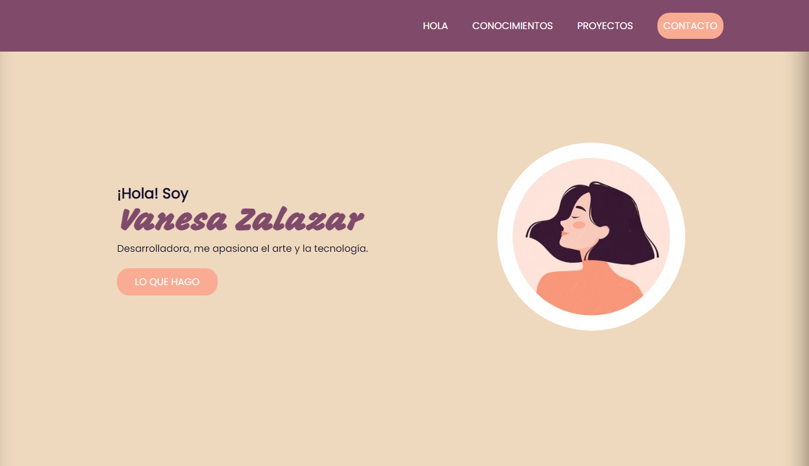

# Portfolio Personal 2023

# Contenido
- [Descripción](#descripción)
- [Previsualización](#previsualización)
- [Sobre el sitio web](#sobre-el-sitio-web) 
- [Diseño](#diseño)
- [Secciones](#secciones)
- [Tecnologías ](#tecnologías)
- [Recursos](#recursos)

## Descripción 
Este es mi portfolio personal, proyecto del primer módulo HTML5 y CSS3, para el curso de desarrollo Frontend de ADA itw.Consiste en el desarrollo de un sitio web en el que se presenta una introducción personal y la presentación de mis proyectos.En el sitio, podrás ver una recopilación de mis trabajos y habilidades en programación y desarrollo web.
[Ver proyecto](https://vanesa-zalazar-portfolio.vercel.app/)

## Previsualización 

## Sobre el sitio web

## Diseño:
El diseño del sitio web está basado en el siguiente [diseño](https://frontend-proyecto-portfolio.adaitw.org/)

## Secciones
El portfolio se divide en 4 secciones 
- **Hola (acerca de mí)** : una breve introducción acerca de mí y mis intereses.
- **Conocimientos** : en esta sección, se puede ver una grilla con los conocimientos adquiridos a la largo de la cursada.
- **Projectos**: en esta sección podrás encontrar una grilla de los proyectos que iré desarrollando.
- **Contacto** : en esta sección se encuentran mis datos de contacto y también se incluye un formulario de contacto para que puedas comunicarte conmigo.

## Tecnologías
- HTML5
- CSS3

## Recursos
- [Imágenes](https://undraw.co/illustrations)
- [Iconos](https://fontawesome.com/)
- [Fuentes](https://fonts.google.com/)

_¡Muchas gracias por visitar mi portfolio!_

